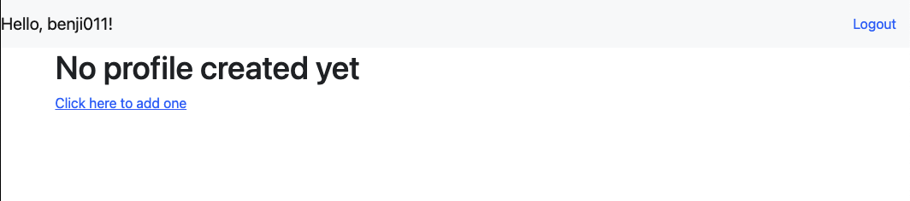
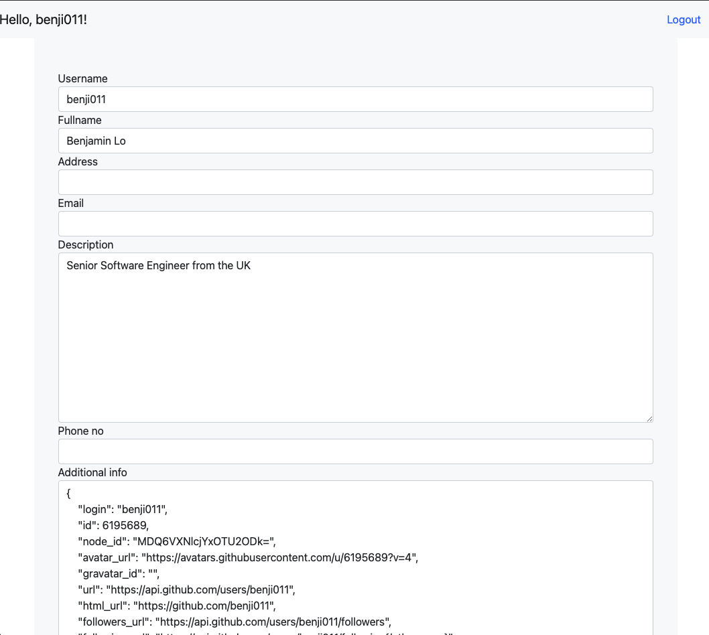

## Program flow

When you first sign in with your GitHub account you will see no profile will have been created yet.

  

Clicking the link will redirect you to the add form. For convenience, the app autopopulates certain fields from your GitHub account via the GitHub API

  

**Please note that `phone_no` has strict validation**. The format should be `+18003334444` (after `1800` the rest of the values can be arbitrary)

After submitting you will be redirected back to the home page with the added profile. This program can be edited or deleted.
